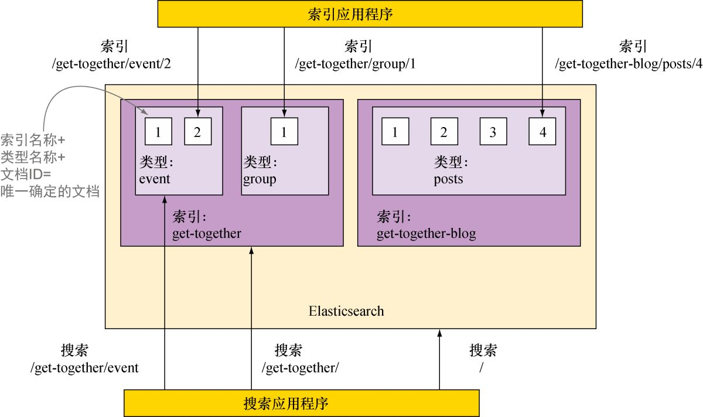
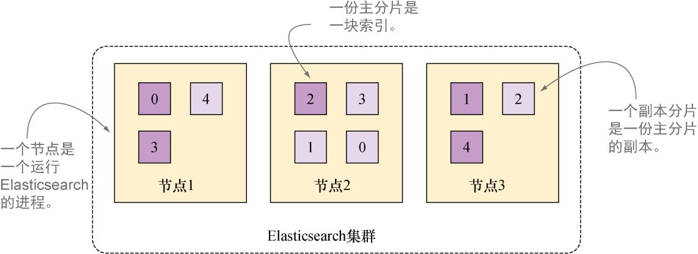
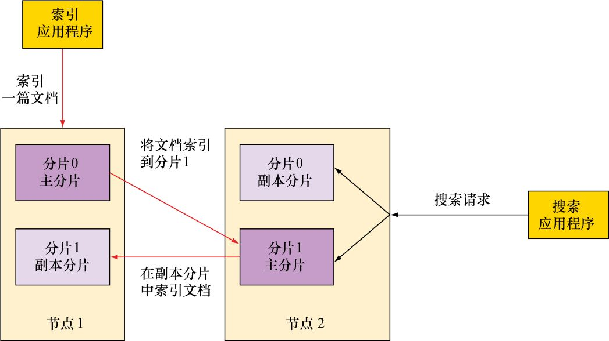
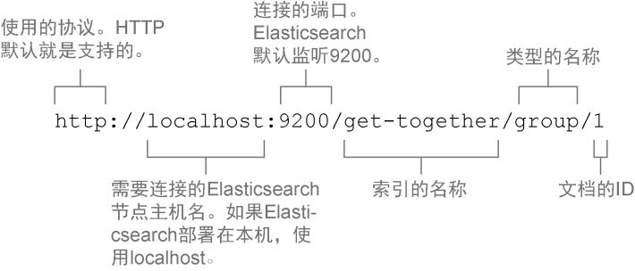

# 2 elasticsearch的内部设计
为了理解Elasticsearch中数据是如何组织的，可以从以下两个角度来观察：
- 逻辑设计 ——应用程序所要注意的。用于**索引**和**搜索**的基本单位是文档，可以将其认为是关系数据库里的一行。文档以类型来分组，类型包含若干文档，类似表格包含若干行。最终，一个或多个类型存在于同一索引 中，索引是更大的容器，类似SQL世界中的数据库。
- 物理设计 ——在后台Elasticsearch是如何处理数据的。Elasticsearch将每个索引划分为**分片** ，每份分片可以在集群中的不同服务器间迁移。通常，应用程序无须关心这些，因为无论Elasticsearch是单台还是多台服务器，应用和Elasticsearch的交互基本保持不变。但是，开始管理集群的时候，就需要留心了。原因是，物理设计的**配置**方式决定了集群的性能、可扩展性和可用性。
## 2.1 逻辑设计：文档、类型和索引
如下图所示,索引—类型—ID的组合唯一确定了Elasticsearch中的某篇文档。当进行搜索的时候，可以查找特定索引、特定类型中的文档，也可以跨多个类型甚至是多个索引进行搜索

### 2.1.1 文档
在elasticsearch中，索引和搜索数据的最小单位是文档。文档有3个重要的属性：
- 自我包含 。一篇文档同时包含字段（如name ）和它们的取值（如Elasticsearch Denver ）。
- 可以是层次型的。文档中还包含新的文档；字段还可以包含其他字段和取值。
- 拥有灵活的结构。文档不依赖于预先定义的模式。例如，并非所有的活动需要“描述”这个字段值，所以可以彻底忽略该字段。但是，活动可能需要新的字段，如“位置”的维度和经度。

尽管可以随意添加和忽略字段，但是每个字段的类型确实很重要。Elasticsearch保存字段和类型之间的映射以及其他设置。这种映射具体到每个索引的每种类型。
### 2.1.2 类型
类型是文档的逻辑容器，类似于表格是行的容器。在不同的类型中，最好放入不同结构（模式）的文档。
每个类型中字段的定义称为映射。例如，name 字段可以映射为string 。而location 中的geolocation 字段可以映射为geo_point 类型.每种字段都是通过不同的方式进行处理.
“无模式”是因为文档并不受模式的限制。它们并不需要拥有映射中所定义的所有字段，也可能提出新的字段.如果一篇新近索引的文档拥有一个映射中尚不存在的字段，Elasticsearch会自动地将新字段加入映射.但最好在索引数据之前，就定义好所需的映射。
### 2.1.3 索引
索引是映射类型的容器。一个Elasticsearch索引非常像关系型世界的数据库，是独立的大量文档集合。
索引存储了所有映射类型的字段，还有一些设置。
你可以跨多个索引进行搜索。这使得组织文档的方式更为灵活。
索引是由一个或多个称为分片的数据块组成，便于扩展机器。
## 2.2 物理设计：节点和分片
默认情况下，每个索引由5个主要分片组成，而每份主要分片又有一个副本，一共10份分片，如图2-3所示.


### 2.2.1 节点
一个节点 是一个Elasticsearch的实例.如果在另一台服务器上启动Elasticsearch，这就是另一个节点。甚至可以通过启动多个Elasticsearch进程，在同一台服务器上拥有多个节点。
多个节点可以加入同一个集群.同样的数据可以在(同一集群中的)多台服务器上传播,这样做有助于提升性能（可用资源变多）和稳定性(副本变多)。
但是集群有两个缺点:确定节点之间能够足够快速地通信，并且不会产生脑裂.(第9章)
#### 2.2.1.1 索引一篇文档时发生了什么
1. 根据文档ID的散列值选择一个主分片，并将文档发送到该主分片。(选定的分片为分片0，但是真正的文档在分片1上，此时es会将分片1的副本发送到分片0所在的节点。)
2. 然后在分片0所在的节点上，对所有副本分片进行索引。
这样设计有2点好处：
- 使得副本分片和主分片之间保持数据的同步。
- 服务于后续的搜索动作。
- 在原有主分片无法访问时自动升级为主分片。



#### 2.2.1.2 搜索索引(整个索引结构)时发生了什么
Elasticsearch在该索引的完整分片集合中进行查找，这些分片可以是主分片，也可以是副本分片。
同时，会进行搜索请求的负载均衡(分发请求，然后聚合结果)，使得副本分片对于搜索性能和容错都有所帮助。

### 2.2.2 分片：主分片和副分片
一份分片 是Lucene的索引：一个包含倒排索引的文件目录。
倒排索引 的结构使得Elasticsearch在不扫描所有文档的情况下，就能告诉你哪些文档包含特定的词条（单词）。
一个Elasticsearch的索引由多个Lucene的索引组成。同时也可以说是由一个或多个主分片以及零个或多个副本分片构成。
副分片是主分片的完整副本。副本分片用于搜索，或者是在原有主分片丢失后成为新的主分片。
可以在任何时候改变每个分片的副本分片的数量，但是在创建索引之前，你必须决定主分片的数量。过少的分片将限制可扩展性，但是过多的分片会影响性能。（默认设置为5份）
文档在分片中均匀分布：对于每篇文档，分片是通过其ID字符串的散列决定的。每份分片拥有相同的散列范围，接收新文档的机会均等.

## 2.3 索引实例
### 使用CURL索引一篇文档
下面这个例子，我们将会通过curl发送json报文给Elasticsearch,查询一篇文档。
url格式如下

请求Json如下，我们通过name和organizer进行查询
```
{
　"name": "Elasticsearch Denver",
　"organizer": "Lee"
}
```
相应的，会获得如下输出,包含索引、类型、索引文档的ID和版本
```
{　
　"_index" : "get-together",
　"_type" : "group",
　"_id" : "1",
　"_version" : 1,
　"created" : true
}
```
### 创建索引和映射类型
同样的，也可以使用CURL的rest方法进行索引和映射类型的创建&查询.
如果我们使用了未经定义的索引|映射进行查询，